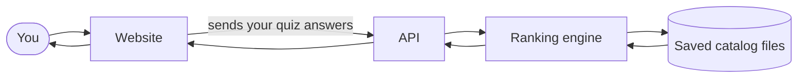
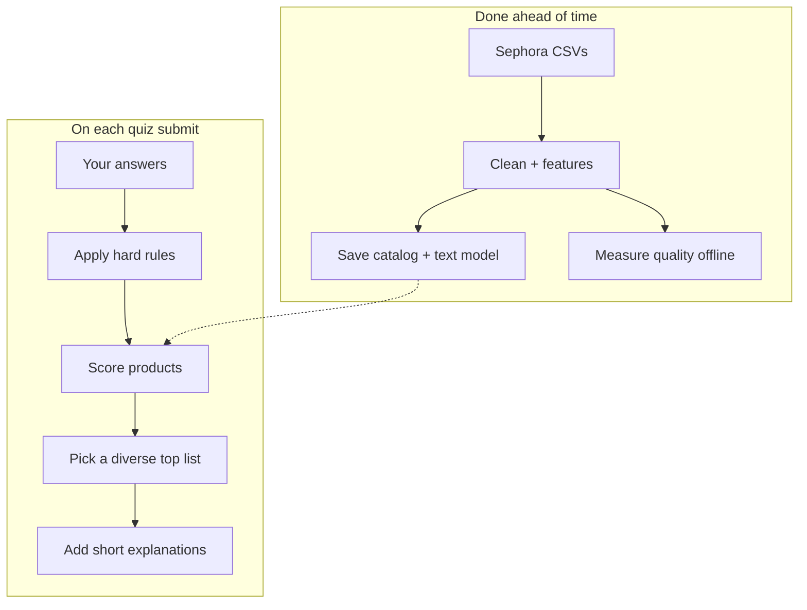
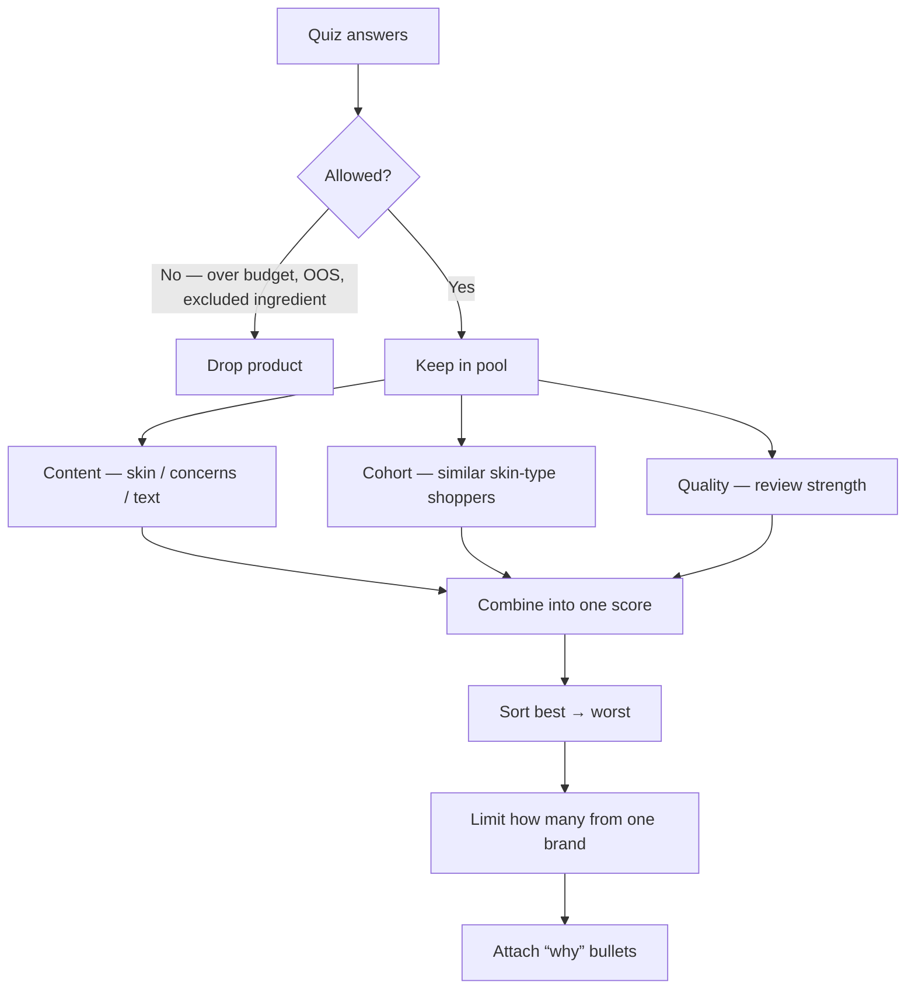

# How the system works

Start with the [README](../README.md). This page is the slightly deeper picture — still meant to be readable.

---

## What happens when you click “Get recommendations”



| Folder | Job |
|---|---|
| `frontend/` | The quiz and results page |
| `backend/` | The API that receives quiz answers |
| `engine/` | Filters, scores, and explanations |
| `src/` | One-time data prep and evaluation (not used on every click) |
| `data/artifacts/` | Pre-built product files the live site reads |

---

## Two phases: prepare once, serve fast



Heavy work (pandas, training text weights) happens **offline**.  
The live site only loads saved files and does light math — so it stays quick to host.

---

## Scoring, step by step



### Hard rules first
Must be in stock, under budget, right category (if chosen), and must not contain excluded ingredients.  
No “almost under budget” soft pass.

### Then scores
Same three pieces as the README (**Content · Cohort · Quality**):

```
content ≈ 34% skin + 34% concerns + 32% text match
final   ≈ 60% content + 25% cohort + 15% quality
```

**Cohort coverage:** we only use the cohort term when a product has **≥ 5** reviews from that skin type. About **18.6%** of skin-type × product pairs meet that bar (`reports/cohort_coverage.json`). For the rest, we skip cohort and lean on content + quality.

**About the mix weights:** Changing them moves results a bit, especially on hard full-catalog tests. We tried other mixes; the one above is the conservative choice we ship. See [BENCHMARK](BENCHMARK.md).

### Keep results varied
In the UI list: at most **2** products from the same brand (and a soft category spread).  
When we **measure** accuracy offline, we turn that off so the score itself is what we’re testing.

### Explanations
We only show a reason if we have supporting data (e.g. “fits dry skin” only if the product is tagged for dry skin).

---

## How it’s hosted

On Vercel, `/api/*` goes to the FastAPI backend; everything else goes to the Next.js site. Before deploy, `scripts/prepare_backend.py` copies the ranking code and catalog files into `backend/` so the API can find them.

---

## Folder map

```
beauty-recommender/
├── frontend/       website
├── backend/        API
├── engine/         ranking logic
├── src/            data prep + evaluation
├── data/artifacts/ files the live API needs
├── data/sample/    tiny samples for quick checks
├── docs/           this documentation
└── tests/          automated tests
```
